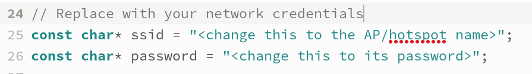
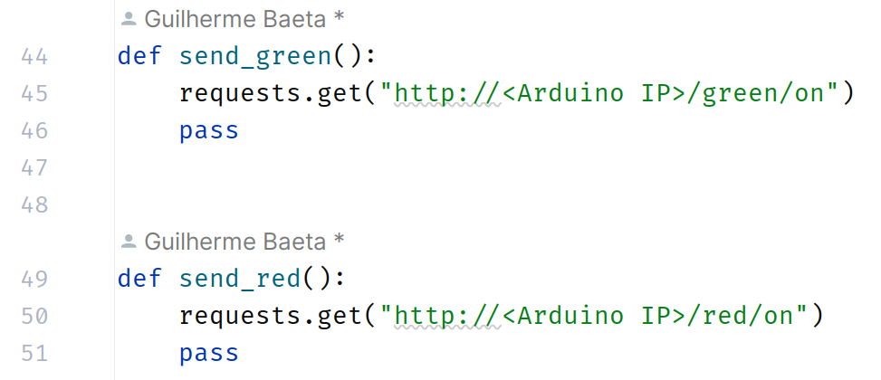

Group 14 Alameda - André Avelar, Guilherme Fontes, José Mateus

# Smart Crosswalks

### Steps to run Code

**On the computer**

- Create a hotspot or connect to a local AP (This AP/Hotspot is very important and will be used by the Arduino and Raspberry Pi. Avoid using a public network since these usually block a lot of common protocols);

- Create a virtual envirnoment (Recommended, If you dont want to disturb python packages);
  
  ```bash
  ### For Linux Users
  python3 -m venv project14
  source project14/bin/activate
  ```

- Upgrade pip with mentioned command below.
  
  ```bash
  pip install --upgrade pip
  ```

- Install requirements with mentioned command below.
  
  ```bash
  pip install -r requirements.txt
  ```
  
  **On the Arduino**

- Connect the Arduino ESP32 to the computer;

- Modify the following traffic_light.ino lines so that the ESP32 Arduino correctly connects to the AP/Hotspot that both the Raspberry Pi and Computer are also connected to:
  

- Finally, build the code onto the Arduino using Arduino IDE.

**On the Raspberry Pi**

- Connect to the same AP/Hotspot as the Arduino and PC;

- The camera to be used must be streaming video to /dev/video0 (in our case since we used a DSLR camera we need to do the following:)
  
  - follow this website tutorial to install and setup v4l2loopback kernel module:
    [Tutorial](https://opensource.com/article/22/12/old-camera-webcam-linux)
  
  - After following the above tutorial, every time you boot up the Raspberry Pi you need to run this to activate the kernel module
    
    ```bash
    sudo modprobe v4l2loopback
    ```
  
  - To get the video stream from the DSLR and pipe it onto /dev/video0: 
    
    ```bash
    gphoto2 --stdout --capture-movie | ffmpeg -i - -vcodec rawvideo -pix_fmt yuv420p -f v4l2 /dev/video0
    ```

- Now that we have /dev/video0 with the video stream from the camera, we need to run the Flask Web server to stream it:
  
  ```bash
  python server.py
  ```
  
  **Back on the Computer now**

- Modify the following lines and put the Arduino IP:
  

- Run the code with mentioned command below (by default, pretrained [yolov7](https://github.com/WongKinYiu/yolov7/releases/download/v0.1/yolov7.pt) weights will be automatically downloaded into the working directory if they don't already exist).
  
  ```bash
  # start smart crosswalk program
  python detect_and_track.py --nosave --img-size 160 --target pedestrians --ip <Raspberry Pi IP>
  ```
